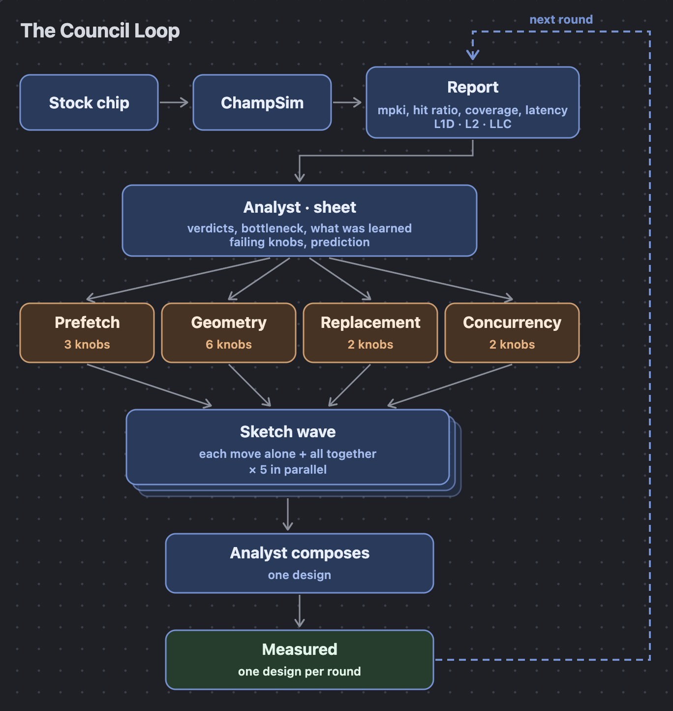

# Few-shot cache tuning by a council of LLM specialists

Tuning a ChampSim cache hierarchy takes simulations, and simulations are the expensive part. The
question is not how good a design you can eventually find. It is **how many designs you have to
measure to get close to it.**

## The result

One ML-inference trace the loop had never seen (llama2_7b, DPC4 `ai-ml`), the stock chip at IPC
0.4731, the best design known at 1.4697 (167 designs measured, 1M warm-up / 2M simulated). Share
of the stock-to-best gap reached after N measured designs, mean over 2 seeds:

| | D1 | D2 | D3 | D4 | D5 | D6 | D8 | D10 | D12 | D14 | D16 |
|---|---|---|---|---|---|---|---|---|---|---|---|
| council, from the stock chip | **47 %** | **86 %** | **88 %** | **94 %** | **96 %** | - | - | - | - | - | - |
| tuned random forest, from the stock chip | 32 % | 85 % | 85 % | 85 % | 90 % | 90 % | 90 % | 90 % | 91 % | 91 % | 91 % |

Both council seeds stopped at D5: every later proposal was refused by the sketches, so no design
was counted after it. The forest row is from the three-trace `aiml` suite at 5M/10M, the only cell it has run on; the
same forest on this trace at this fidelity is run next.

How long the tuned searches take to reach the council's D5 level:

| | 96 % of the gap |
|---|---|
| council | **D5**, both seeds on the same design |
| tuned random forest, 16 designs | not reached (91 % at D16, 90 % at D12) |
| reference run, the forest run to 100 designs | between D47 (95 %) and D65 (97.6 %): at least 9x |

The forest and reference numbers are from the `aiml` suite at 5M/10M.

## How it works



One round, one counted design. The **analyst** reads every design measured so far and writes a
sheet: a verdict per cache level with the number behind it, the bottleneck, what the run has
learned with its deltas, which knobs are failing by their own counters, a prediction. Four
**specialists** (prefetch, geometry, replacement, concurrency; each owns its knobs) read the sheet
and each propose one move on one level, or hold. Every proposal is **sketched** with cheap
simulations, alone and all together, so the interaction between moves is a measured number before
anything is committed. The analyst **composes** the round's design from the proposals with the
sketches in front of it; a design the sketches predict to lose is refused and costs nothing. The
composed design is measured and counted. Round 1 is the analyst's opening design from the stock
chip's report. When every specialist holds, the analyst proposes a design of its own; the search
stops when it has nothing either.

Two arms, same budget, seeds and fidelity, both from the stock chip: `council`, and `bo`, a random
forest with expected improvement, one design a round. The reference for a suite is the same forest
run to 100 designs (`search ceiling`); the best design measured on every workload of the suite is
the denominator every share divides by. The model is Gemini 3.1 Pro on Vertex; each specialist's
prompt names no workload, trace or chip.

## Layout

| file | role |
|---|---|
| `loop/space.py` | what a design is: 13 knobs, the area budget |
| `loop/simulate.py` | a design to numbers: ChampSim's config, the build, the run |
| `loop/suite.py` | the objective, and the result tables that cache it |
| `loop/search.py` | the two arms, the driver, the score table, the ceiling |
| `loop/council.py` | the analyst, the specialists, the sketches |
| `loop/analyst.py` | the model call |
| `loop/workloads.py` | fetching a trace |
| `results/tables/` | the shared simulation cache, one per workload and fidelity: the dataset |
| `results/runs/` | a run's report: every design, every round with its sketches |
| `upstream/` | patches for ChampSim and CHIA |

## Setup

`results/tables/` holds every simulation result, so the score tables can be reproduced without a
simulator or a trace:

```bash
git clone https://github.com/mateobuscarons/chia_hackathon.git && cd chia_hackathon
python3 -m venv .venv && .venv/bin/pip install -r requirements.txt   # Python 3.10+
git clone --depth 1 https://github.com/ChampSim/ChampSim.git champsim  # the stock chip's config; no build needed
LOOP_WARMUP=1000000 LOOP_SIM=2000000 .venv/bin/python -m loop.search score results/runs/llama2_f31.json
```

To simulate new designs, build ChampSim with the SPP fix, fetch the traces and log in to Vertex:

```bash
cd champsim && git submodule update --init
git apply ../upstream/0002-champsim-spp-dev-ghr-victim.patch   # without it, spp_dev designs crash
./vcpkg/bootstrap-vcpkg.sh && ./vcpkg/vcpkg install
./config.sh champsim_config.json && make -j8 && cd ..
for i in $(seq 1 7); do cp -r champsim champsim_$i; done          # several designs compile at once

# the ML-inference traces: 200 MB prefixes from the DPC4 bucket; the file name keys the tables
curl -s https://pub-c31f67d79d1b4cd28ff320612b1a9f84.r2.dev/manifest.txt | grep ai-ml
.venv/bin/python -m loop.workloads fetch <object url> traces/llama2.c-llama2_7b.1.champsimtrace.gz 200
# the smoke gate's SPEC17 traces
curl -sSLO --output-dir traces https://dpc3.compas.cs.stonybrook.edu/champsim-traces/speccpu/605.mcf_s-665B.champsimtrace.xz
curl -sSLO --output-dir traces https://dpc3.compas.cs.stonybrook.edu/champsim-traces/speccpu/619.lbm_s-2676B.champsimtrace.xz

gcloud auth application-default login                              # Gemini on Vertex
SEEDS=1 .venv/bin/python -m loop.search smoke s1                   # the gate: both arms, one round
```

## Run

```bash
SEEDS=2 BUDGET=20 LOOP_WARMUP=1000000 LOOP_SIM=2000000 python -m loop.search llama2 f1 council
SEEDS=2 BUDGET=16 python -m loop.search aiml a1                    # both arms on the suite
python -m loop.search score results/runs/aiml_a1.json
python -m loop.search ceiling 100 10 <trace> <trace> <trace>       # the independent reference
```

A design is simulated once, ever: results are cached in `results/tables/`, keyed by the design's
name and the fidelity, and every run reads the cache before simulating. Every prompt and answer of
a run is in `results/<arm>-<tag>-s<seed>.log`.

Design, operations and open work are in `CLAUDE.md`. Contributions back to CHIA and ChampSim are
in `CHIA_BLOCKS.md`.
